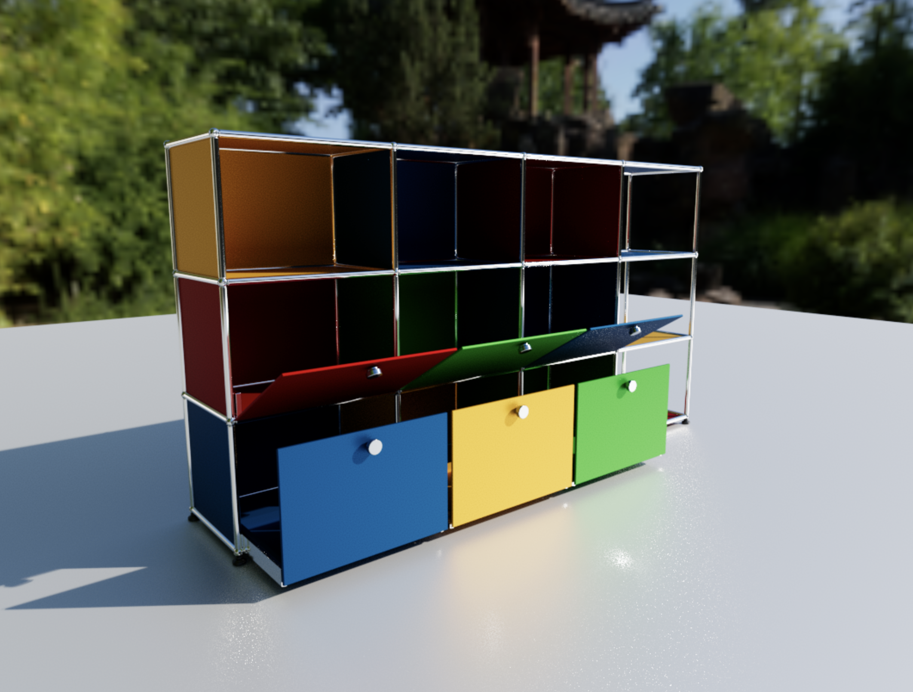

# PoC three.js GPU Pathtracer fro Rubens Configurations

PoC wich uses [three-gpu-pathtracer](https://github.com/gkjohnson/three-gpu-pathtracer) to render Rubens configurations.

A configuration or plan can be loaded by passing the id as a query parameter to the url: `?id=<configurationId>`

e.g.:

```none
https://roomle-dev.github.io/poc-rubens-threejs-gpu-pathtracer/dist/client/?id=usm:frame:9C4BC73D19BAAD07675CDDEA721F493BB126939392FF80318204B089BD55C71A
```

[**Preview**][1]

[][1]

 [1]: https://roomle-dev.github.io/poc-rubens-threejs-gpu-pathtracer/dist/client/?id=usm:frame:9C4BC73D19BAAD07675CDDEA721F493BB126939392FF80318204B089BD55C71A
